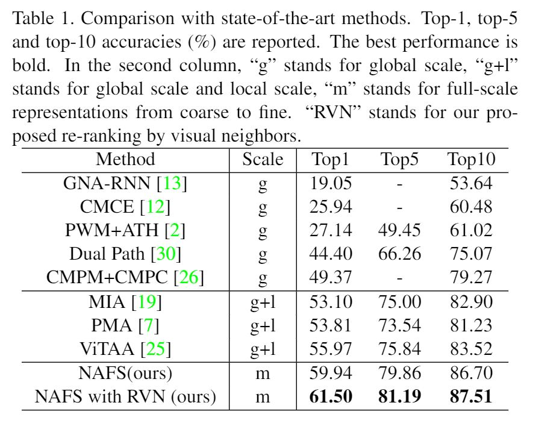
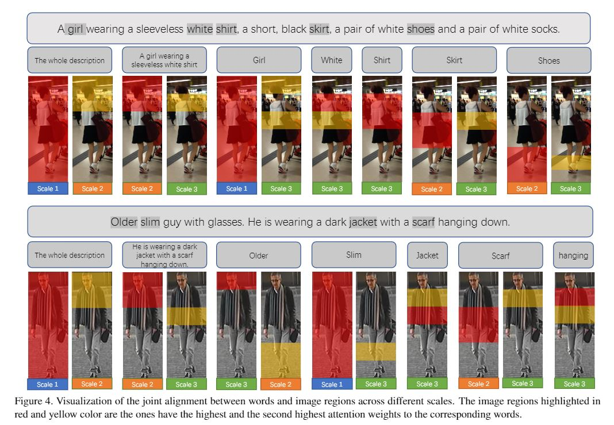

# Contextual Non-Local Alignment over Full-Scale Representation for Text-Based Person Search
This is an implementation for our paper ***Contextual Non-Local Alignment over Full-Scale Representation for Text-Based Person Search.***  The code is modified from [Github repositoty](https://github.com/labyrinth7x/Deep-Cross-Modal-Projection-Learning-for-Image-Text-Matching) "pytorch implementation for ECCV2018 paper [Deep Cross-Modal Projection Learning for Image-Text Matching](http://openaccess.thecvf.com/content_ECCV_2018/papers/Ying_Zhang_Deep_Cross-Modal_Projection_ECCV_2018_paper.pdf)".
## Requirement
* Python 3.7
* Pytorch 1.0.0 & torchvision 0.2.1
* numpy
* matplotlib (not necessary unless the need for the result figure)  
* scipy 1.2.1 
* pytorch_transformers
## Usage

### Data Preparation

1. Please download [CUHK-PEDES dataset](https://github.com/ShuangLI59/Person-Search-with-Natural-Language-Description) .
2. Put reid_raw.json under project_directory/data/
3. run data.sh
2. Copy files **test_reid.json**, **train_reid.json** and **val_reid.json** under CUHK-PEDES/data/ to project_directory/data/processed_data/
3. Download [pretrained Resnet50 model](https://download.pytorch.org/models/resnet50-19c8e357.pth),  [bert-base-uncased model](https://s3.amazonaws.com/models.huggingface.co/bert/bert-base-uncased.tar.gz) and [vocabulary](https://s3.amazonaws.com/models.huggingface.co/bert/bert-base-uncased-vocab.txt) to project_directory/pretrained/

### Training & Testing

You should firstly change the parameter `BASE_ROOT` to your current directory and `IMAGE_DIR` to the directory of CUHK-PEDES dataset.
Run command sh scripts/train.sh to train the model. 
Run command sh scripts/test.sh to evaluate the model. 

## Model Framework

## Model Performance

